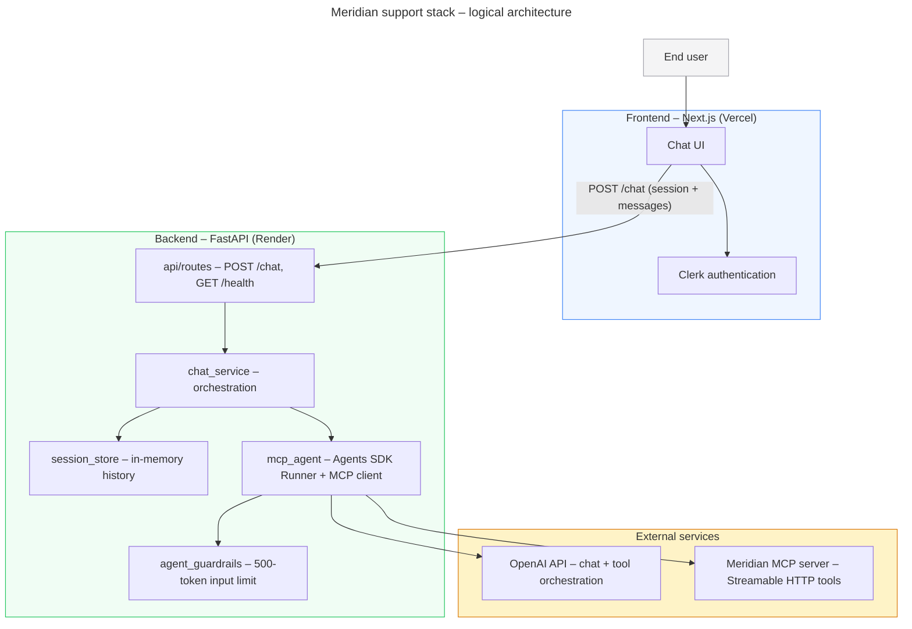
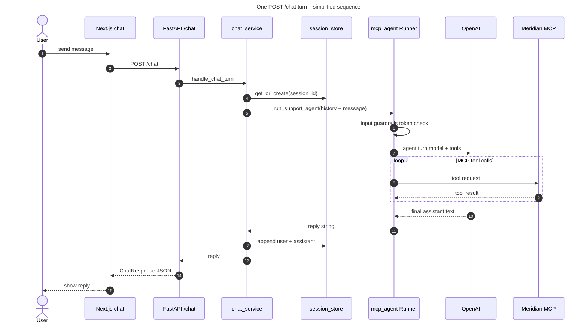
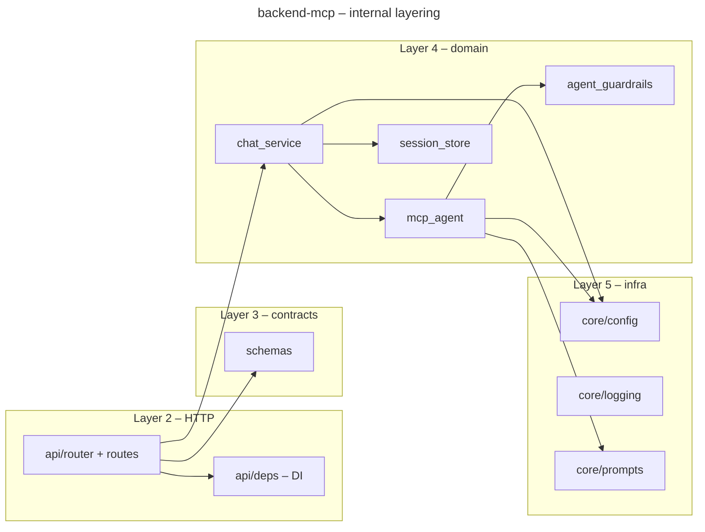

# System architecture

High-level views of the Meridian customer-support stack: **Next.js** (Clerk) → **FastAPI** (OpenAI Agents SDK + in-memory sessions) → **OpenAI** and the **Meridian MCP** tool server.

---

## Components and data flow

**Notes**

- The browser sends only the latest user line per turn; **session history** is replayed from `session_store` on the server.
- **MCP tools** (catalog, auth, orders, etc.) are discovered over **Streamable HTTP** and invoked by the agent loop.
- **Input guardrails** run before the main model step (`run_in_parallel=false`) so oversized prompts fail fast with HTTP 400.

---

## Chat turn (sequence)

---

## Backend layering (FastAPI package)

This mirrors the layout described in the project `README` and `AGENTS.md`.
